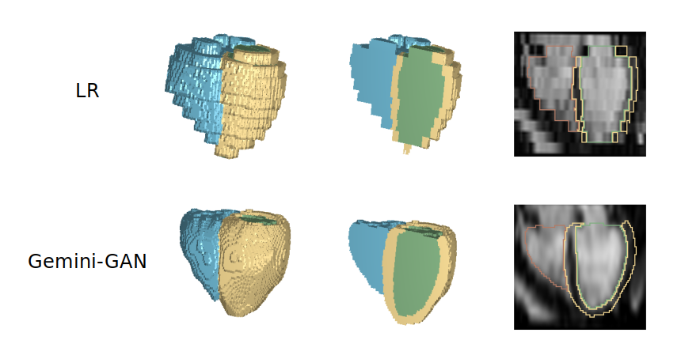
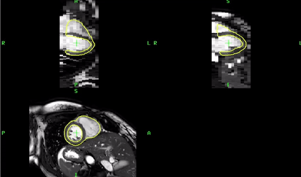
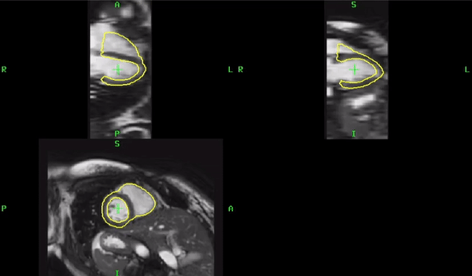
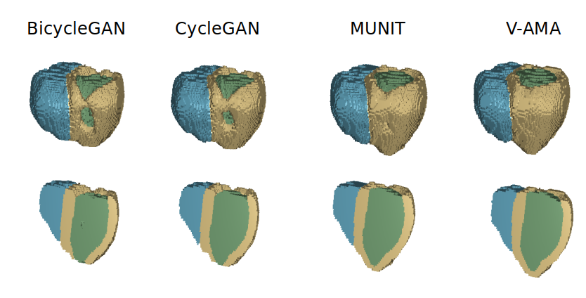

# Joint Semi-supervised 3D Super-Resolution and Segmentation with Mixed Adversarial Gaussian Domain Adaptation




Optimising the analysis of cardiac geometry and motion requires accurate threedimensional representations, however medical imaging applications are conventionally limited to acquiring contiguous cross-sections with low through-plane resolution and inherent spatial misalignment. Super-Resolution (SR) is used in computer vision tasks to recover SR images from LR inputs but these are trained on transformations of the acquired images and are not optimized for segmentation tasks. Here we propose a semi-supervised algorithm that jointly estimates super-resolved cine greyscale images and their corresponding three-dimensional segmentation using natively SR ground truth. This uses a multi-task generative adversarial network (Gemini-GAN) for SR and segmentation, and an unsupervised variational adversarial mixture autoencoder (V-AMA) for continuous domain adaptation. Our pipeline is extensively evaluated on three transnational multi-ethnic populations improving on the state-of-the-art for 3D segmentation accuracy with high peak signal-to-noise ratio and structural similarity index measures. Our V-AMA model also exceeded the performance of state-of-art generative domain adaptation models for both segmentation and SR. This demonstrates how joint cardiac image SR and segmentation, trained on 3D ground-truth data, enables precision phenotyping across domains.


# Dependencies

Before getting started with the code, it's important to have a working environment with all dependencies satisfied. We recommend using the Anaconda distribution of Python 3.5. 


```bash

cd /tmp
curl -O https://repo.anaconda.com/archive/Anaconda3-2019.03-Linux-x86_64.sh
bash Anaconda3-2019.03-Linux-x86_64.sh

```

PyTorch must be installed, please make sure that cuDNN is installed correctly (https://developer.nvidia.com/cudnn).

```bash
conda install pytorch torchvision cudatoolkit=9.2 -c pytorch

```

Then install the following libraries:

```bash
pip install torchvision
pip install opencv-python
pip install matplotlib
pip install tqdm
pip install SimpleITK
pip install vtk
pip install scikit-image
pip install nibabel
pip install pickle5
```

The Mirtk installation (http://mirtk.github.io/getstarted.html) is only needed for testing the classic super-resolution methods (i.e., Linear/NN/BSpline) and for the alignment block in the V-AMA code.

# Code

The code is divided into three main folders: Gemini-GAN, V-AMA, and Tools. In the Gemini-GAN folder is the proposed main model and the comparative DL models. 
In the V-AMA folder is the main V-AMA model with the comparison models. Finally, in Tools folder, is general support code for this project.

##  [Gemini-GAN Folder](https://github.com/ImperialCollegeLondon/Gemini-GAN/tree/master/Gemini-GAN)

In the Gemini-GAN folder, we can also find three python files: Gemini-GAN.py, seg_SRGAN.py, and UNet.py. Before running the code please make sure to set the paths as described internally in each file. Then, please run the traning with the following command:

```
python Gemini-GAN.py
```

In the subdirectory test, there are two main python files: Classic_test.py and DL_test.py. 

* With `Classic_test.py` you can easily test the classic super-resolution methods such as Linear/NN/BSpline

* With `DL_test.py` you can test the deep learning method (previously trained). Please remember to set all paths in each code before starting. 

Then, start the test with the following command:

```
cd test
python Classic_test.py
python DL_test.py
```



*Low Resolution with 3D Segmentation prediction*



*Joint Super-Resolution and 3D Segmentation prediction*


##  [V-AMA Folder](https://github.com/ImperialCollegeLondon/Gemini-GAN/tree/master/V-AMA)

In the V-AMA folder you can also find the python file `v_ama.py` which, in addition to containing the code of the proposed V-AMA model, contains the comparative methods MUNIT, CycleGAN, and BicycleGAN.  
Before running the code make sure to set the paths as described in the file. After setting the paths please run the training with the following command:

```
python v_ama.py
```

In the subdirectory test there is the python test file called `test.py`. Then, after setting the paths you can start the test with the following command:

```
cd test
python test.py
```

Finally, the subdirectory alignment block is used for spatial alignment between source and target volumes before domain adaption for which you will need Mrtk installed.



##  [Tools Folder](https://github.com/ImperialCollegeLondon/Gemini-GAN/tree/master/Tools)

The tools folder is organized in a subdirectory as follows:

* [./4DCine](https://github.com/ImperialCollegeLondon/Gemini-GAN/tree/master/Tools/4DCine) folder contains the code for creating the 4D Cine for both super-resolution and 3D Segmentation.
* [./dataset](https://github.com/ImperialCollegeLondon/Gemini-GAN/tree/master/Tools/Dataset) folder contains the code used for supporting the dataset creation (i.e., train, validate, test).


## Acknowledgments

The study was supported by Bayer AG; Medical Research Council (MC-A658-5QEB0); National Institute for Health Research (NIHR) Imperial College Biomedical Research Centre; British Heart Foundation (NH/17/1/32725, RG/19/6/34387, RE/18/4/34215); Academy of Medical Sciences (SGL015/1006); Mason Medical Research Trust grant; and the Engineering and Physical Sciences Research Council (EP/P001009/1).

Also, some models are been adapted from these repositories:

* UNet: https://github.com/milesial/Pytorch-UNet
* MUNIT, CycleGAN, and BicycleGAN: https://github.com/eriklindernoren/PyTorch-GAN

## Citation

Savioli N, de Marvao A, Bai W, Wang S, Cook SA, Chin CWL, Rueckert D, O’Regan DP. Joint Semi-supervised 3D Super-Resolution and Segmentation with Mixed Adversarial
Gaussian Domain Adaptation. arXiv. 2021.

## Datasets

Paired low and high resolution cardiac labels maps. 

Savioli N, O'Regan DP. Cardiac super-resolution label maps. Mendeley Data, V1, doi: [10.17632/pw87p286yx.1](https://doi.org/10.17632/pw87p286yx.1)

## License

Distributed under the GNU GENERAL PUBLIC LICENSE license.
